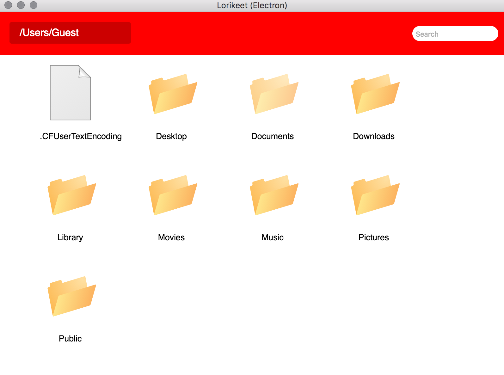

# lorikeet

A cross-platform file explorer implemented in both Electron and NW.js

## Electron
We use [electron-builder](https://github.com/electron-userland/electron-builder) for Electron app packaging. Follow these [instructions](https://github.com/electron-userland/electron-builder/wiki/Multi-Platform-Build) to set up your Mac for multiple platform builds.

To build app for Windows, Mac and Linux:
```bash
cd electron
npm install
node_modules/.bin/build -mwl
```

## NW.js
We use [nw-builder](https://github.com/nwjs/nw-builder) for Electron app packaging.

```bash
cd nwjs
npm install
npm install evshiron/nw-builder -g
nwbuild –p win32,win64,osx32,osx64,linux32,linux64 –o ./build .
```
---


